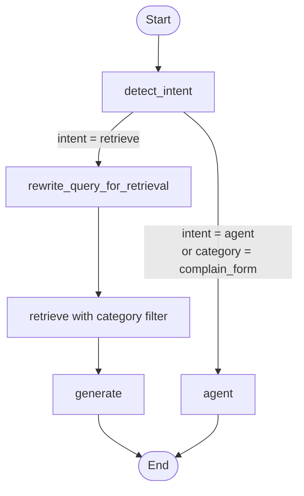

# A Simple HR assistant

This project is a lightweight HR assistant that helps employees ask questions about internal policies, benefits, leave, onboarding, training, travel, and related HR topics.

From a business point of view, the assistant is meant to support common HR self-service use cases such as:

- answering employee questions from company policy documents
- narrowing retrieval to the right HR category before searching
- returning a simple complaint form for complaint-related requests
- giving HR or operations teams a traceable assistant workflow they can inspect and extend

Under the hood, the assistant uses:

- **LangGraph** for orchestration
- **OpenAI** for chat and dense embeddings
- **Qdrant** in **local mode** for retrieval
- **Optional FastEmbed BM25** for sparse retrieval on supported platforms
- **Dense retrieval by default**, with optional hybrid search via Qdrant dense + sparse retrieval
- **Category metadata** stored in Qdrant and used as a retrieval filter
- **A complaint-form agent path** for non-retrieval HR requests
- **LangSmith** via environment variables for tracing

## Business context

The repository models a small internal HR support assistant for an organization with multiple policy areas. Instead of searching every document in the same way, the assistant first determines the type of request and then routes it appropriately:

- policy questions go through category-aware retrieval
- complaint-form requests go to a dedicated agent path

This makes the behavior easier to reason about in a business workflow:

- HR teams can organize source material by function
- retrieval stays narrower and easier to audit
- non-policy requests can be handled separately from document search
- the graph is simple enough to explain to stakeholders and extend later

## Project structure

```text
simple_rag/
├── app/
│   ├── config.py
│   ├── ingestion/
│   │   ├── ingest.py
│   │   ├── query.py
│   │   └── vectorstore.py
│   └── rag/
│       ├── utils/
│       │   ├── tools.py
│       │   ├── nodes.py
│       │   └── state.py
│       ├── agent.py
│       └── main.py
├── data/docs/
│   ├── benefits/
│   ├── finance/
│   ├── handbook/
│   ├── leave/
│   ├── onboarding/
│   ├── performance/
│   ├── security/
│   ├── training/
│   └── travel/
├── .env.example
├── pyproject.toml
└── README.md
```

## 1. Install uv

```bash
brew install uv
```

Other install options are available in the official uv docs if you are not on macOS.

## 2. Use Python 3.11

```bash
uv python install 3.11
uv sync
```

The project is pinned to Python 3.11 via `.python-version`. This avoids slow or failing dependency resolution on older local interpreters such as Python 3.9.

`uv sync` creates a `.venv` automatically.

If you want hybrid dense+sparse retrieval on a platform that supports `fastembed`, install the optional extra:

```bash
uv sync --extra hybrid
```

On Intel macOS, `uv` may fail to resolve `onnxruntime` for `fastembed`. In that case, stay on the default install and the app will use dense retrieval automatically.

## 3. Configure environment variables

```bash
cp .env.example .env
```

Then edit `.env` and add your real keys.

Minimum setup:

```env
OPENAI_API_KEY=your_openai_api_key
LANGSMITH_API_KEY=your_langsmith_api_key
LANGSMITH_TRACING=true
LANGSMITH_PROJECT=rag-hybrid-qdrant-demo
```

## 4. Ingest documents

```bash
uv run rag-ingest
```

This creates a local Qdrant database directory and indexes the files from `data/docs/`.
The command prints whether it indexed in `dense` or `hybrid` mode.
The sample documents are organized in nested category folders, and the loader scans them recursively.

During ingestion, each chunk gets metadata including:
- `category`
- `document_name`
- `source_path`

Those metadata fields are stored in Qdrant and the retriever uses `metadata.category` as a filter during retrieval.

## 5. Run the app

```bash
uv run rag-chat "What is the employee probation period?"
```

Example output will include:
- the final answer
- the retrieved source previews

Example business questions:

```bash
uv run rag-chat "How many days of parental leave does a primary caregiver get?"
uv run rag-chat "What is the hotel limit for business travel?"
uv run rag-chat "Can you give me a complaint form?"
```

## 6. Inspect indexed chunks

You can inspect what is stored in Qdrant without running the full graph:

```bash
uv run rag-search
```

With no argument, `rag-search` scrolls the whole local collection and prints indexed chunks with their metadata.

You can also test retrieval only:

```bash
uv run rag-search "What is the parental leave policy?"
```

That shows the matched chunks, their category, their source path, and a short preview.

You can also run the modules directly:

```bash
uv run python -m app.ingestion.ingest
uv run python -m app.ingestion.query
uv run python -m app.rag.main "What is the employee probation period?"
```

## How the graph works

The graph starts by classifying the user request with structured output.
Complaint-form requests go directly to the agent path.
Policy-style questions are rewritten for retrieval and then searched in Qdrant with a category filter.



Node responsibilities:

1. `detect_intent` uses a Pydantic schema and structured LLM output to classify the request as `agent` or `retrieve`, and to choose a category when retrieval is needed.
2. `rewrite_query_for_retrieval` rewrites the original question into a more retrieval-friendly query while preserving meaning.
3. `retrieve` queries Qdrant and applies the detected `metadata.category` filter when a category is available.
4. `generate` answers strictly from the retrieved context.
5. `agent` handles complaint-form requests and can return a simple complaint form template.

In business terms, the graph separates:

- document-backed HR questions
- operational complaint-form requests

That separation keeps the retrieval path focused on policy search while still allowing a different user experience for form-style workflows.

## Current categories

The retrieval layer currently recognizes these document categories:

- `benefits`
- `complain_form`
- `finance`
- `handbook`
- `leave`
- `onboarding`
- `performance`
- `security`
- `training`
- `travel`

## Notes

- If you change documents or metadata logic, rebuild the local knowledge base with `uv run rag-ingest`.
- This repo uses Qdrant local mode, so only one process can hold the local database lock at a time.
- The complaint-form path is routed through the `agent` node and does not depend on retrieval.
- This is a demo-style assistant, so the sample documents and form output are intentionally simple and meant to be extended for a real business environment.
